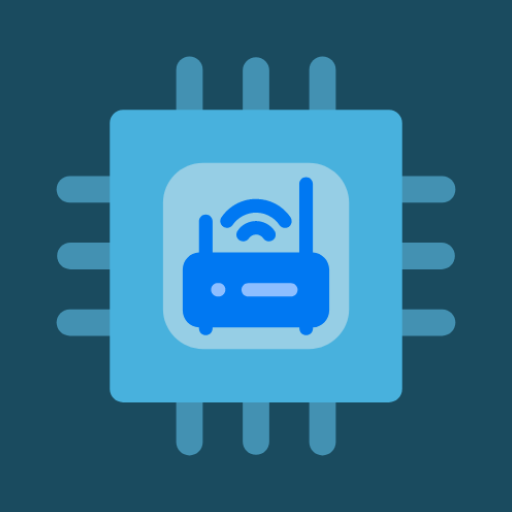
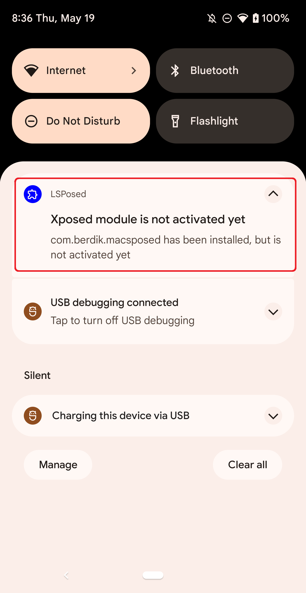
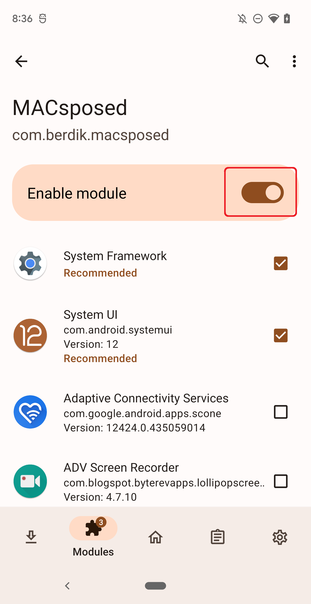
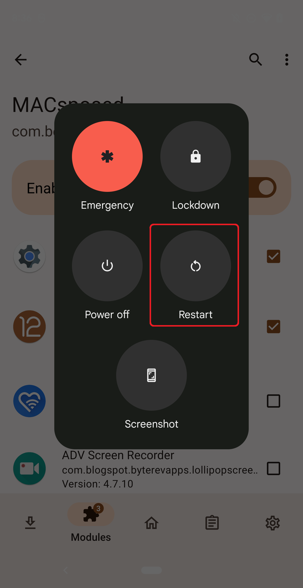
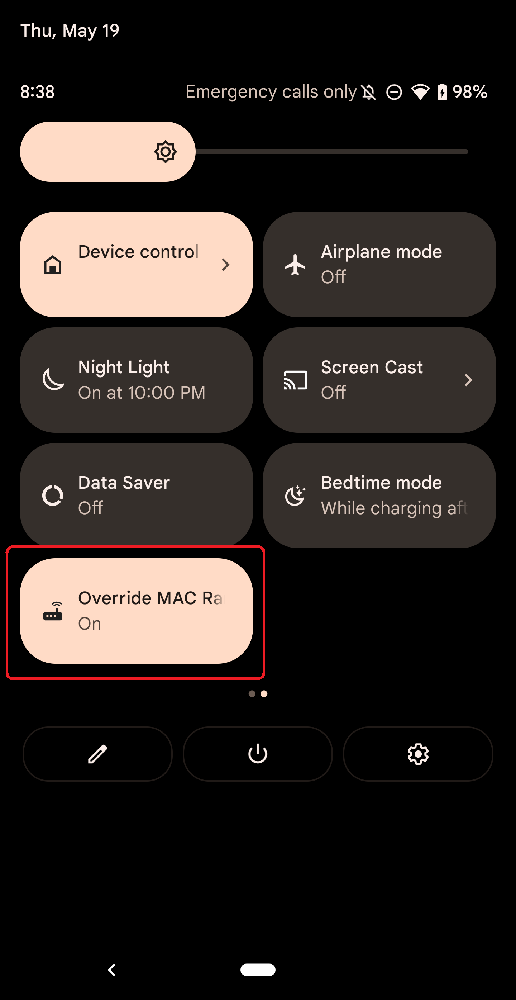
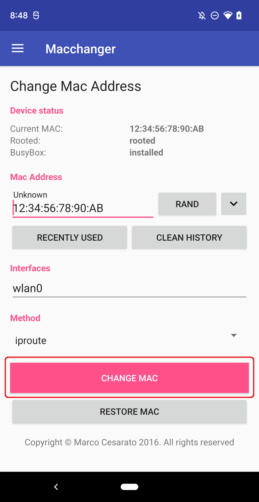
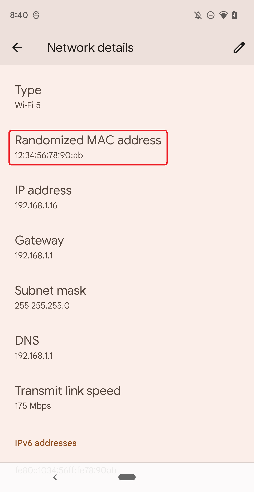

# MACsposed

Historically, setting a custom MAC address on Android was very easy for rooted users. Starting with Android 12, however, Google's implementation of MAC address randomization has made it impossible, as the MAC address is always changed when the network state is altered. If you have encountered this problem, then you need MACsposed! MACsposed is an Xposed module that blocks the MAC address randomizer on Android 12 and 13 and allows you to once again make use of your favorite tools for setting your MAC address. Simply install MACsposed, enable it, and go back to randomizing your MAC address using your favorite tools for doing so!

**⚠️ WARNING:** MACsposed is intended for rooted devices running Android 12 or 13 and requires Xposed. The recommended Xposed variant to use is LSPosed. Other Xposed variants may work, but have not been tested. Additionally, this module cannot be guaranteed to work on all devices. In the worst case, it can cause a bootloop. Use at your own risk.

  
  
  

To use MACsposed:
1. Install LSposed. This requires your device to be rooted with Magisk. Installation instructions for LSPosed are available [here](https://github.com/LSPosed/LSPosed#install).
2. Install MACsposed.
3. Activate the MACsposed module in the LSposed user interface.

  
  

4. Reboot your device and sign in.

  

5. Open the quick settings panel. The MACsposed tile will appear.

  

6. Toggle the MACsposed tile on or off to enable or disable it.
7. Use your favorite tool for setting a custom MAC address!

  
  

